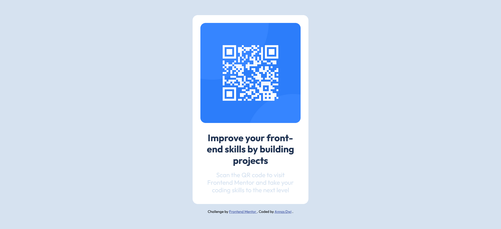

# Frontend Mentor - QR code component solution

This is a solution to the [QR code component challenge on Frontend Mentor](https://www.frontendmentor.io/challenges/qr-code-component-iux_sIO_H). Frontend Mentor challenges help you improve your coding skills by building realistic projects.

## Table of contents

- [Overview](#overview)
  - [Screenshot](#screenshot)
  - [Links](#links)
- [My process](#my-process)
  - [Built with](#built-with)
  - [What I learned](#what-i-learned)
- [Author](#author)

**Note: Delete this note and update the table of contents based on what sections you keep.**

## Overview

Buat komponen jadi di tengah halaman selalu jadi tantangan, stuck beberapa menit sampe akhirnya dapet solusi buat bikin tengah elemen QR nya

### Screenshot



### Links

- Live Site URL: [https://fm-beginner-qrcode.vercel.app/](https://fm-beginner-qrcode.vercel.app/)

## My process

### Built with

- Semantic HTML5 markup
- CSS custom properties
- Flexbox
- Mobile-first workflow

### What I learned

Buat bikin tengah sebuah komponen width dan height harus ditentukan atau lebih lebar dari ukuran elemennya. Kalau ukuran child element dan parent element sama jadi gabisa dibikin center child elemennya.

Agar elemen ke tengah bisa pake `margin` atau `flex`

```css
body {
  height: 100vh;
}
```

## Author

- Frontend Mentor - [@anasdwc](https://www.frontendmentor.io/profile/anasdwc)
- Twitter - [@anasdwc](https://www.twitter.com/anasdwc)
