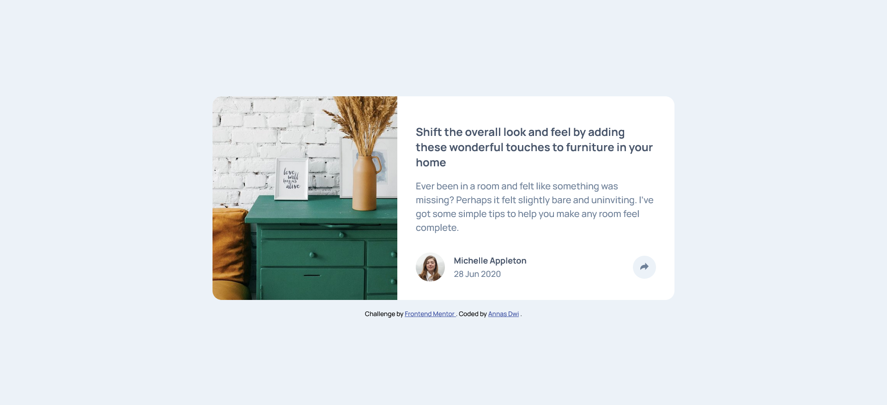

# Frontend Mentor - Article preview component solution

This is a solution to the [Article preview component challenge on Frontend Mentor](https://www.frontendmentor.io/challenges/article-preview-component-dYBN_pYFT). Frontend Mentor challenges help you improve your coding skills by building realistic projects.

## Table of contents

- [Overview](#overview)
  - [The challenge](#the-challenge)
  - [Screenshot](#screenshot)
  - [Links](#links)
- [My process](#my-process)
  - [Built with](#built-with)
  - [What I learned](#what-i-learned)
  - [Continued development](#continued-development)
  - [Useful resources](#useful-resources)
- [Author](#author)

## Overview

### The challenge

Users should be able to:

- View the optimal layout for the component depending on their device's screen size
- See the social media share links when they click the share icon

### Screenshot

### Links

- Solution URL: [Frontend Mentor | Article Preview Card | Flex and Grid coding challenge solution](https://www.frontendmentor.io/solutions/article-preview-component-A-dB_iGI7u)
- Live Site URL: [Frontend Mentor | Article preview component](https://fm-beginner-article-preview.vercel.app/)

## My process

### Built with

- Semantic HTML5 markup
- CSS custom properties
- Flexbox
- CSS Grid
- Mobile-first workflow

### What I learned

Media query juga bisa bantu bikin hal yg berbeda antara desktop dan mobile dan bisa dimanfaatin bareng Javascript

### Continued development

- [ ] Add animation on share button

### Useful resources

- [CSS Tooltip](https://www.w3schools.com/css/css_tooltip.asp) - ini bantu buat bikin arrow bottom di tooltip pake _pseudo_ CSS

## Author

- Frontend Mentor - [@anasdwc](https://www.frontendmentor.io/profile/anasdwc)
- Twitter - [@anasdwc](https://www.twitter.com/anasdwc)
