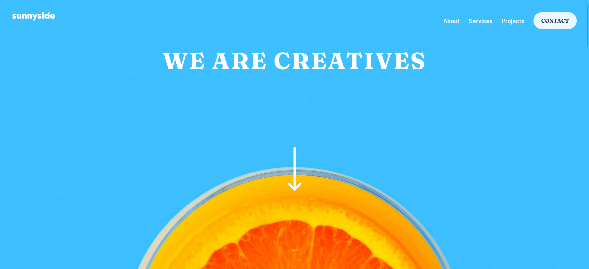

# Frontend Mentor - Sunnyside agency landing page solution

This is a solution to the [Sunnyside agency landing page challenge on Frontend Mentor](https://www.frontendmentor.io/challenges/sunnyside-agency-landing-page-7yVs3B6ef). Frontend Mentor challenges help you improve your coding skills by building realistic projects.

## Table of contents

- [Overview](#overview)
  - [The challenge](#the-challenge)
  - [Screenshot](#screenshot)
  - [Links](#links)
- [My process](#my-process)
  - [Built with](#built-with)
  - [What I learned](#what-i-learned)
  - [Continued development](#continued-development)
  - [Useful resources](#useful-resources)
- [Author](#author)

## Overview

### The challenge

Users should be able to:

- View the optimal layout for the site depending on their device's screen size
- See hover states for all interactive elements on the page

### Screenshot

### Links

- Solution URL: [Frontend Mentor | Sunnyside Landing Page | ReactJS & TailwindCSS coding challenge solution](https://www.frontendmentor.io/solutions/sunnyside-agency-landing-page-s7yOsMX8Pm)
- Live Site URL: [Frontend Mentor | Sunnyside agency landing page](https://fm-junior-sunnyside.netlify.app/)

## My process

### Built with

- Semantic HTML5 markup
- CSS custom properties
- Flexbox
- CSS Grid
- Mobile-first workflow
- [React](https://reactjs.org/) - JS library
- [TailwindCSS]

### What I learned

Sebuah segitiga bisa dibuat dengan manfaatin border width. Beberapa sisi yg ga dibutuhin bisa dibuat transparent dan sisi lainnya diberi warna. Sehingga bisa terbentuk segitiga

### Continued development

- [ ] Add animation on navbar

### Useful resources

- [CSS Triangle | CSS-Tricks - CSS-Tricks](https://css-tricks.com/snippets/css/css-triangle/) - helped me to create triangle using CSS

## Author

- Frontend Mentor - [@anasdwc](https://www.frontendmentor.io/profile/anasdwc)
- Twitter - [@anasdwc](https://www.twitter.com/anasdwc)
