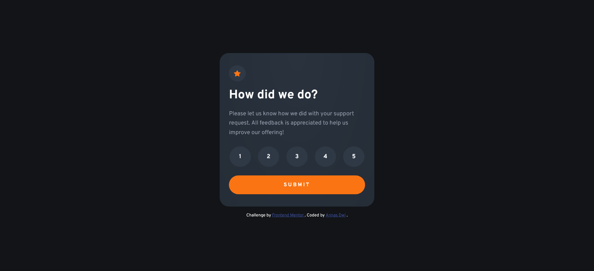

# Frontend Mentor - Interactive rating component solution

This is a solution to the [Interactive rating component challenge on Frontend Mentor](https://www.frontendmentor.io/challenges/interactive-rating-component-koxpeBUmI). Frontend Mentor challenges help you improve your coding skills by building realistic projects.

## Table of contents

- [Overview](#overview)
  - [The challenge](#the-challenge)
  - [Screenshot](#screenshot)
  - [Links](#links)
- [My process](#my-process)
  - [Built with](#built-with)
  - [What I learned](#what-i-learned)
  - [Useful resources](#useful-resources)
- [Author](#author)

## Overview

### The challenge

Users should be able to:

- View the optimal layout for the app depending on their device's screen size
- See hover states for all interactive elements on the page
- Select and submit a number rating
- See the "Thank you" card state after submitting a rating

### Screenshot



### Links

- Solution URL: [Frontend Mentor | Interactive Rating Component with Flex, CSS, and Javascript coding challenge solution](https://www.frontendmentor.io/solutions/interactive-rating-component-hvirY5RHue)
- Live Site URL: [Frontend Mentor | Interactive rating component](https://fm-beginner-interactive-rating.vercel.app/)

## My process

### Built with

- Semantic HTML5 markup
- CSS custom properties
- Flexbox
- CSS Grid
- Mobile-first workflow
- Javascript

### What I learned

Membuat lingkaran sempurna dan responsive lebih baik manfaatin `height` dan `width` daripada pakai `padding` doang

Terus bisa manfaatin `flex` biar label dari input radio bisa di tengah

```css
label {
  border-radius: 50%;
  padding: 1rem;
  width: 40%;
  height: 40%;
  display: flex;
  justify-content: center;
  align-items: center;
}
```

### Useful resources

- [Remove Circle Button in Radio Button And Use The Label As Picker - JSFiddle - Code Playground](https://jsfiddle.net/petrabarus/pPgS7/) - Sumber ini berguna buat menghilangkan radio button biar cuma nampilin label, tapi fungsi dari radio masih bekerja

## Author

- Frontend Mentor - [@anasdwc](https://www.frontendmentor.io/profile/anasdwc)
- Twitter - [@anasdwc](https://www.twitter.com/anasdwc)
