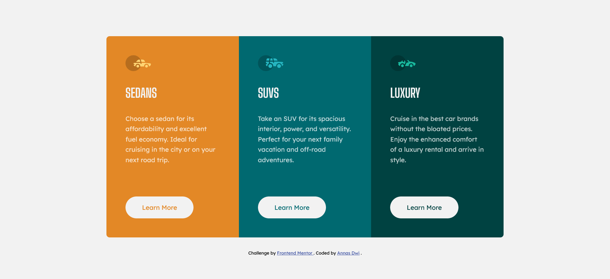

# Frontend Mentor - 3-column preview card component solution

This is a solution to the [3-column preview card component challenge on Frontend Mentor](https://www.frontendmentor.io/challenges/3column-preview-card-component-pH92eAR2-). Frontend Mentor challenges help you improve your coding skills by building realistic projects.

## Table of contents

- [Overview](#overview)
  - [The challenge](#the-challenge)
  - [Screenshot](#screenshot)
  - [Links](#links)
- [My process](#my-process)
  - [Built with](#built-with)
- [Author](#author)

## Overview

### The challenge

Users should be able to:

- View the optimal layout depending on their device's screen size
- See hover states for interactive elements

### Screenshot

### Links

- Solution URL: [Frontend Mentor | 3 Column Preview | Flex and Grid coding challenge solution](https://www.frontendmentor.io/solutions/3column-preview-card-component-z9BDhM-zic)
- Live Site URL: [Frontend Mentor | 3-column preview card component](https://fm-beginner-3-column.vercel.app/)

## My process

### Built with

- Semantic HTML5 markup
- CSS custom properties
- Flexbox
- CSS Grid
- Mobile-first workflow

## Author

- Frontend Mentor - [@anasdwc](https://www.frontendmentor.io/profile/anasdwc)
- Twitter - [@anasdwc](https://www.twitter.com/anasdwc)
