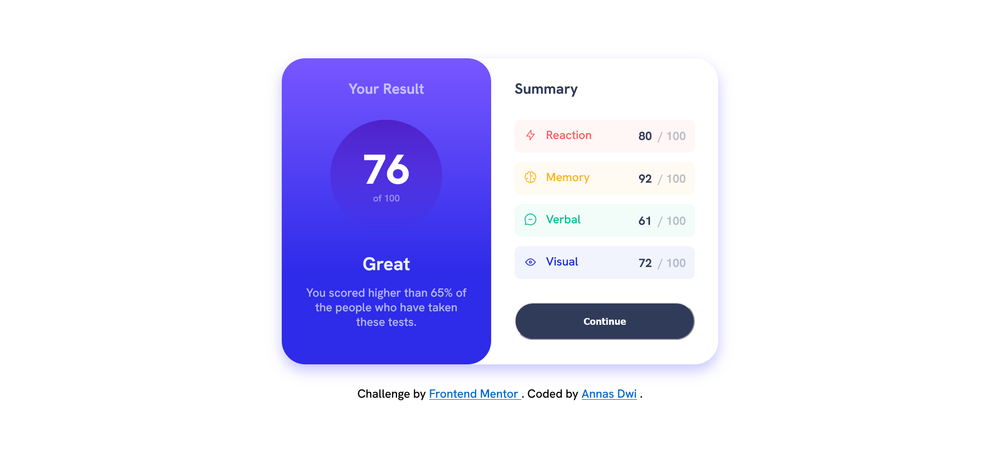

# Frontend Mentor - Results summary component solution

This is a solution to the [Results summary component challenge on Frontend Mentor](https://www.frontendmentor.io/challenges/results-summary-component-CE_K6s0maV). Frontend Mentor challenges help you improve your coding skills by building realistic projects.

## Table of contents

-   [Overview](#overview)
    -   [The challenge](#the-challenge)
    -   [Screenshot](#screenshot)
    -   [Links](#links)
-   [My process](#my-process)
    -   [Built with](#built-with)
    -   [What I learned](#what-i-learned)
-   [Author](#author)

## Overview

### The challenge

Users should be able to:

-   View the optimal layout for the interface depending on their device's screen size
-   See hover and focus states for all interactive elements on the page
-   **Bonus**: Use the local JSON data to dynamically populate the content

### Screenshot

### Links

-   Solution URL: [https://www.frontendmentor.io/solutions/result-summary-component-html-and-css-responsive-8-oPq9bhKB](https://www.frontendmentor.io/solutions/result-summary-component-html-and-css-responsive-8-oPq9bhKB)
-   Live Site URL: [https://fm-newbie-result-summary.netlify.app/](https://fm-newbie-result-summary.netlify.app/)

## My process

### Built with

-   Semantic HTML5 markup
-   CSS custom properties
-   CSS Grid

## Author

-   Frontend Mentor - [@anasdwc](https://www.frontendmentor.io/profile/anasdwc)
-   Twitter - [@anasdwc](https://www.twitter.com/anasdwc)

**Note: Delete this note and add/remove/edit lines above based on what links you'd like to share.**
