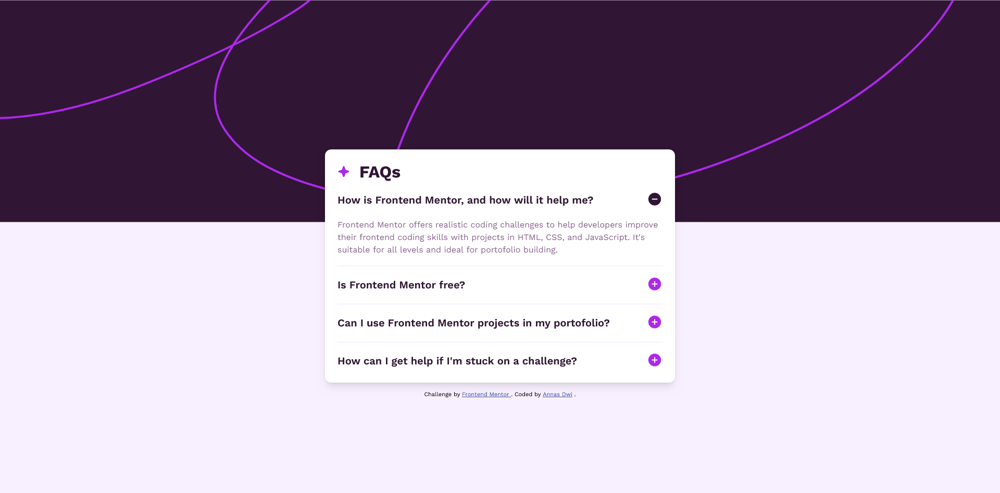

# Frontend Mentor - FAQ accordion solution

This is a solution to the [FAQ accordion challenge on Frontend Mentor](https://www.frontendmentor.io/challenges/faq-accordion-wyfFdeBwBz). Frontend Mentor challenges help you improve your coding skills by building realistic projects.

## Table of contents

-   [Overview](#overview)
    -   [The challenge](#the-challenge)
    -   [Screenshot](#screenshot)
    -   [Links](#links)
-   [My process](#my-process)
    -   [Built with](#built-with)
-   [Author](#author)

## Overview

### The challenge

Users should be able to:

-   Hide/Show the answer to a question when the question is clicked
-   Navigate the questions and hide/show answers using keyboard navigation alone
-   View the optimal layout for the interface depending on their device's screen size
-   See hover and focus states for all interactive elements on the page

### Screenshot

### Links

-   Solution URL: [Here](https://github.com/anasdwc/frontend-mentor/tree/main/newbie/3-faq-accordion-main)
-   Live Site URL: [Here](https://classy-hotteok-92ac70.netlify.app/)

## My process

### Built with

-   Semantic HTML5 markup
-   CSS custom properties
-   Flexbox
-   CSS Grid
-   Mobile-first workflow
-   Tailwind CSS
-   Uno CSS
-   Alpine.js

## Author

-   Frontend Mentor - [@anasdwc](https://www.frontendmentor.io/profile/anasdwc)
-   Twitter - [@anasdwc](https://www.twitter.com/anasdwc)
